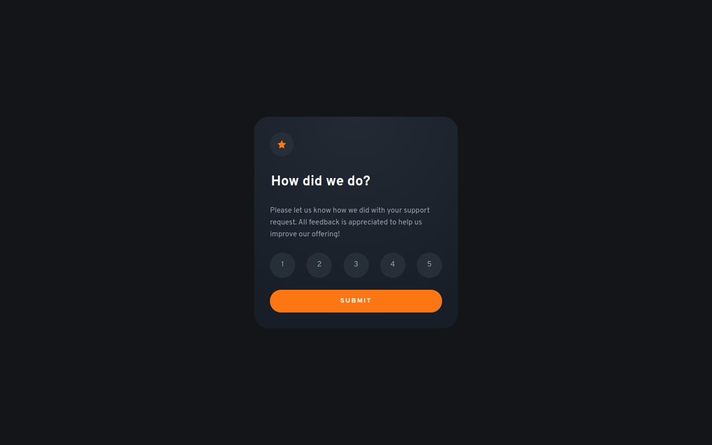

# Frontend Mentor - Interactive rating component solution

This is a solution to the [Interactive rating component challenge on Frontend Mentor](https://www.frontendmentor.io/challenges/interactive-rating-component-koxpeBUmI). Frontend Mentor challenges help you improve your coding skills by building realistic projects.

## Table of contents

- [Overview](#overview)
  - [The challenge](#the-challenge)
  - [Screenshot](#screenshot)
  - [Links](#links)
- [My process](#my-process)
  - [Built with](#built-with)
  - [What I learned](#what-i-learned)
  - [Useful resources](#useful-resources)
- [Author](#author)

## Overview

### The challenge

Users should be able to:

- [x] View the optimal layout for the app depending on their device's screen size
- [x] See hover states for all interactive elements on the page
- [x] Select and submit a number rating
- [x] See the "Thank you" card state after submitting a rating

### Screenshot

### Links

- [Frontend Mentor solution page](https://www.frontendmentor.io/solutions/interactive-rating-component-with-react-vite-cube-css-and-tailwind--r50ceLujX)
- [Live site](https://joshjavier.github.io/interactive-rating-component/)

## My process

### Built with

- [React](https://reactjs.org/)
- [Vite](https://vitejs.dev/) - dev server and build tool
- [Tailwind CSS](https://tailwindcss.com/) &times; [CUBE CSS](https://cube.fyi/)
- Semantic HTML5 markup
- Mobile-first workflow

### What I learned

I used semantic elements whenever possible to avoid having to write additional JavaScript. For the thank you modal, I used the `<dialog>` element which comes with an overlay that can be styled with `::backdrop`.

For the implementation of the rating component, I used radio buttons which have built-in semantics and interactivity. Sara Soueidan's article on [Inclusively Hiding & Styling Checkboxes and Radio Buttons](https://www.sarasoueidan.com/blog/inclusively-hiding-and-styling-checkboxes-and-radio-buttons/) was a huge help as I did manual testing with VoiceOver on iOS to ensure the buttons are accessible by touch users.

### Useful resources

- [Inclusively Hiding & Styling Checkboxes and Radio Buttons](https://www.sarasoueidan.com/blog/inclusively-hiding-and-styling-checkboxes-and-radio-buttons/) by Sara Soueidan
- [Custom Controls](https://www.w3.org/WAI/tutorials/forms/custom-controls/) from W3C WAI
- [Star rating input](https://www.magentaa11y.com/checklist-web/star-rating/) from MagentaA11y web accessibility checklist
- [Understanding progressive enhancement](https://blog.logrocket.com/understanding-progressive-enhancement/) by Joel Adewole
- [Quick Tip: Don’t Forget the “noscript” Element](https://webdesign.tutsplus.com/tutorials/quick-tip-dont-forget-the-noscript-element--cms-25498) by Thoriq Firdaus

## Author

**Josh Javier**

- [Personal website](https://joshjavier.com/)
- [Frontend Mentor](https://www.frontendmentor.io/profile/joshjavier)
- [Twitter](https://twitter.com/joshjavierr)
- [LinkedIn](https://ph.linkedin.com/in/joshjavier)
